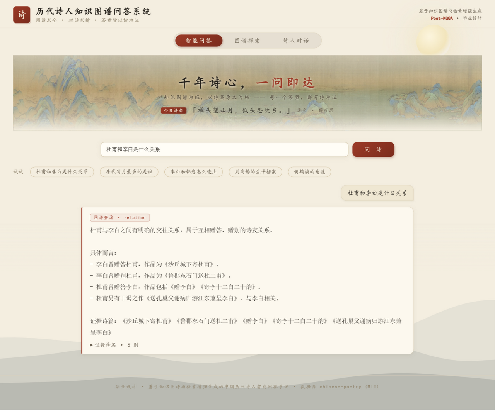
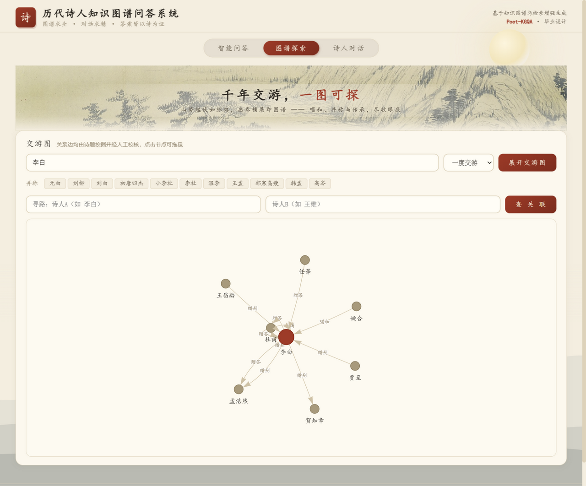

# 历代诗人知识图谱问答系统（poet-kgqa）

> 本科毕业设计 · 基于知识图谱与检索增强生成的中国历代诗人智能问答系统
> 数据底座：[chinese-poetry](https://github.com/chinese-poetry/chinese-poetry)（MIT）全唐诗 58 卷 **57,607 首**、诗人 **3,662 位**

**Neo4j 图谱 + FAISS 向量双轨检索 + BERT NER 消歧 + DeepSeek 证据化生成**，全部组件可在普通笔记本 CPU 上运行，任一组件缺席自动降级、永不离线。

> **🚀 在线试用**（部署于云服务器，长期可用）：<https://movie.jszzbinfo.cn/poet/>
> 三页均可实际操作；如需本机部署见下方"快速开始"，或看[展示页](https://liuzhiqiang23.github.io/poet-kgqa/)。

| 智能问答（证据链） | 图谱探索（交游图） | 诗人对话（人格+时间锚） |
|---|---|---|
|  |  |  |

<sub>截图即真实界面；点上方"在线试用"可直接操作。</sub>

## 功能特性

**① 智能问答** —— 图谱/语义双轨，意图路由规则优先：
- 关系类："杜甫和李白是什么关系" → 交游关系 + 具体诗篇证据（《沙丘城下寄杜甫》等可展开回溯原文）
- 路径类："李白和韩愈怎么连上" → 最短路径（李白→孟浩然→…→韩愈，4 跳）
- 统计类："唐代写月最多的是谁" → 存诗量/意象榜（白居易 654 / 李白 448）
- 赏析类：bge 向量检索 + 简繁双路召回（RRF 融合）+ 诗题置顶加权，引用语料原文
- 每个事实型答案都带**可溯源证据卡**，LLM 只组织语言、不生成查询语句

**② 图谱探索** —— pyvis 力导向图：任意诗人的一跳/二跳交游子图，138 条 ASSOC 边全部由诗题挖掘并经人工复核；任意两诗人最短路径查询（李白→苏轼不连通，如实返回）

**③ 诗人对话** —— 30 位可对话诗人，人格档案由图谱构建：
- 第一人称对话，事实以图谱档案为准（"图谱管事实、模型管表达"）
- **时间锚拒答**：问李白"你怎么看苏轼？"会被生卒年拦下，不会穿越

**界面**：水墨风设计（宣纸底色/朱砂印鉴/楷体/竖排书脊证据卡），三个页面分别以《千里江山图》《富春山居图》《文会图》局部为横幅（公有领域）；语料底本为繁体，显示层统一转简体。

## 实验结果（论文第六章）

| 实验 | 结果 |
|---|---|
| 一致性主实验（n=100，五类问题） | 裸 LLM **66%** vs 图谱约束 **100%**（+34pp） |
| 检索消融（15 条名句锚点，hit@3） | 向量+双路增强 **80.0%** vs 关键词扫描 **13.3%** |
| 交游边质量 | 443 条诗篇级证据 → 143 关系对 → 消歧隔离 43 对 → 人工逐条复核 39 放行/4 驳回 → **138 对全部定案** |

> 口径说明：约束臂中关系/意象/存诗量类答案由图谱事实直接构造，其 100% 反映的是"事实注入后组织层不篡改事实"，而非模型能力提升；生卒年类（幻觉抑制）才是对模型行为的真实测量（详见论文第六章"实验解释边界"）。

## 快速开始

```bash
# 0) 环境：Python 3.10+；语义检索需带 torch 的解释器（bge 模型）
pip install flask zhconv faiss-cpu sentence_transformers   # 无 faiss 用 numpy 亦可

# 1) 建库管线（按序执行，可重复）
python scripts/00_download_corpus.py      # 全唐语料 ~24MB（jsDelivr 通道）
python scripts/01_load_corpus.py          # 底表 poets/poems.jsonl
python scripts/02_mine_title_edges.py     # 诗题模式挖交游边（繁简双形别名+动词）
python scripts/03_disambiguate.py         # 消歧审计 + 并称表合并
python scripts/04_ner_bios.py             # BERT NER 抽小传实体（可选）
python scripts/05_build_neo4j.py          # Neo4j 导入包（CSV + 幂等 LOAD CSV）
python scripts/06_build_faiss.py          # bge 向量化 57,607 首（CPU 约 10 分钟）

# 2) 启动
POET_KGQA_USE_NEO4J=1 NEO4J_PASSWORD=<你的密码> <torch解释器> web/app.py
# → http://127.0.0.1:5000
```

**降级设计（核心卖点之一）**：
- Neo4j 未启动 → 自动落 `JsonlGraph` 后端，接口与输出完全一致
- FAISS/向量索引未建 → 自动落关键词扫描模式
- DeepSeek key：环境变量 `DEEPSEEK_API_KEY`（缺失时图谱查询仍可直出 summary）
- 繁体语料：别名表收简繁双形；显示层统一转简体（`web/app.py` to_hans）

## 技术架构

```
离线建库（scripts/00-06，可重复执行）
  chinese-poetry JSON ─→ 底表 ─→ 诗题挖边(BERT NER 小传实体)
                                ─→ 三层消歧(别名表/置信分层/人工复核)
                                ─→ Neo4j(3662诗人·57607作品·138 ASSOC·11并称)
                                ─→ bge-small-zh + FAISS/numpy(57,607 单元)

在线问答（Flask 单进程）
  用户问句 → 意图路由(规则优先) ─┬→ 图谱链：实体链接→参数化Cypher→LLM组织
                                └→ 语义链：双路召回+RRF融合+题名加权→LLM引用
  persona 对话：图谱档案+生卒时间锚+护栏 → DeepSeek
```

| 层 | 技术 |
|---|---|
| 图数据库 | Neo4j Community 5.26（无库时 JsonlGraph 兜底） |
| 语义检索 | bge-small-zh-v1.5 + FAISS（NumPy 兜底），简繁双路 + RRF + 诗题加权 |
| 信息抽取 | 诗题模式规则挖掘 + CLUENER BERT NER（小传实体） |
| 生成 | DeepSeek API（事实注入式提示，参数化 Cypher，LLM 不写查询） |
| 前端 | Flask + 原生 JS + pyvis，水墨风单页三签 |

## 目录结构

```
scripts/    编号化建库管线 00-06 + 头像/横幅素材管线 07-10
kg/         graph_service.py  查询统一层（Neo4jGraph / JsonlGraph 接口一致）
rag/        retriever.py      语义检索（向量优先，关键词兜底）
chat/       router / entity_link / qa / persona / generator
web/        app.py + templates/index.html（三页单文件应用）
eval/       190 题评测集 + 一致性实验 + 消融实验脚本与结果
docs/       实验报告、论文构建管线（parse_md → docx-js → 目录预填 → 校验）
data/       alias（人工别名/并称/生卒表）、processed（图谱底表）、raw/index/models（不入库）
```

> 完整建库文档见各脚本文件头注释；头像取自维基共享资源公有领域古典画像（22 位，无画像者以"名句诗签"生成 8 位）；界面横幅为公有领域古画局部。

## License

代码 MIT；语料 chinese-poetry（MIT）；古画与画像为公有领域。仅供学习交流。
